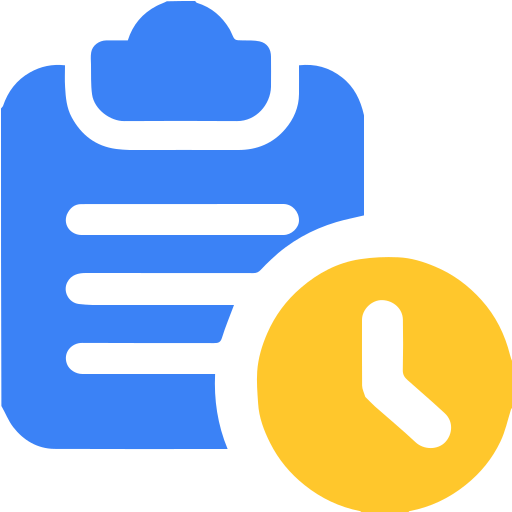

  

  <h1>Statly</h1>

> Transform your TickTick productivity data into meaningful insights

[Live Demo](#) | [Features](#features) | [Tech Stack](#tech-stack)

---

## About Statly

**Statly** is a comprehensive productivity analytics platform that transforms your TickTick focus time data into actionable insights. By syncing your TickTick account, you can visualize your productivity patterns, track task completion, set challenges, and earn achievements—all through an intuitive, beautifully designed interface.

Whether you're looking to understand where your time goes, identify your most productive periods, or gamify your productivity journey, Statly provides multiple unique perspectives on your data. From detailed focus records to visual analytics dashboards, Statly helps you make data-driven decisions about how you work.

Built for productivity enthusiasts who want more than just task tracking, Statly turns raw productivity data into a personalized dashboard that motivates and informs your daily work habits.

---

## How It Works

1. **Connect Your TickTick Account** - Securely sync your TickTick data with Statly
2. **Automatic Data Sync** - Your focus records, tasks, and projects are automatically imported
3. **Explore Multiple Views** - View your productivity data through 6 unique perspectives
4. **Track & Improve** - Set goals, complete challenges, and earn achievements as you build better habits

---

## Features

Statly offers six powerful ways to view and analyze your productivity data:

### Focus Records
View all your focus sessions in one comprehensive timeline. Filter and sort by date, duration, project, and more to understand exactly how you're spending your time. Each record shows detailed information including:
- Session duration and timestamps
- Associated tasks and projects
- Tasks completed during the record's session
- Focus notes

Perfect for analyzing your work patterns and identifying peak productivity hours.

---

### Completed Tasks
View all tasks you've completed, organized by day. See your daily accomplishments in either a nested hierarchy or flat breadcrumb view. Features include:
- Daily grouping of completed tasks (e.g., "Tasks completed on January 3, 2026")
- **Nested view**: Indented parent-child task relationships
- **Breadcrumb view**: Flat view with ancestor task paths
- Search by task name or content
- Sort by newest, oldest, most completed tasks, or least completed tasks
- Filter by date range and projects

Perfect for reviewing your task completion history and understanding your daily productivity patterns.

---

### Stats (Analytics Dashboard)
Beautiful, interactive visualizations that reveal your productivity trends over time. The Stats page features three distinct views:

**Overview View**
- Total tasks, completed tasks, and projects count
- Active days tracking
- Today's action report
- High-level productivity metrics

**Task View**
- Task completion statistics and trends
- Completed tasks curve over time
- Task-specific analytics

**Focus View**
- Focus session details and breakdowns
- Daily focus hour goals tracking
- Focus duration curves and trends
- Focus records timeline
- Most focused time analysis
- Year-at-a-glance calendar heatmap grids

Powered by ApexCharts and Recharts for smooth, responsive data visualization.

---

### Medals
Automatically earn medals for reaching productivity milestones based on your TickTick data. Medals are organized by type and time interval to track your achievements across different scales:

**Medal Types**
- **Focus Medals**: Earned for hitting focus hour milestones (e.g., "Focus 10h in a day")
- **Task Medals**: Earned for completing task count goals (e.g., "Complete 50 Tasks in a day")

**Time Intervals**
- **Daily**: Track day-to-day accomplishments
- **Weekly**: Monitor weekly productivity goals
- **Monthly**: Celebrate monthly achievements
- **Yearly**: Long-term productivity milestones

Features include:
- Automatic medal unlocking based on your productivity data
- Medal gallery showing earned and locked achievements
- Progress tracking toward unearned medals
- Customizable medal images (default or custom uploads)
- Filter medals by type and interval

Build a visual collection of your productivity journey and celebrate each milestone you achieve.

---

### Challenges
Work toward lifetime productivity milestones with predefined challenges that track your cumulative achievements. Unlike medals which reset by time interval, challenges are one-time accomplishments based on your total productivity across all time.

**Challenge Types**
- **Focus Challenges**: Cumulative focus hour milestones (e.g., "Focus 100 Hours", "Focus 1,000 Hours", up to "Focus 20,000 Hours")
- **Task Challenges**: Total task completion goals (e.g., "Complete 100 Tasks", "Complete 1,000 Tasks", up to "Complete 50,000 Tasks")

Features include:
- View all available challenges organized by type (Focus/Tasks)
- Track progress toward uncompleted challenges
- See completion dates for achieved challenges
- Filter challenges by type
- Visual gallery of completed and locked challenges

These lifetime achievements provide long-term goals to work toward throughout your productivity journey.

---

### Focus Time Goal
Track your daily focus time goals with an Apple Watch-inspired rings interface. Create up to 3 customizable rings, each tracking progress toward a specific focus time target. Monitor your progress in real-time and build consistent productivity habits through visual feedback and streak tracking.

**Ring System**
- **Visual Progress Rings**: Circular progress indicators showing today's focus time vs your goal
- **Multiple Rings**: Create up to 3 rings simultaneously (Apple Watch-style concentric circles)
- **Project Filtering**: Attach specific projects to each ring (e.g., a 30-minute "Exercise" ring that only counts time from your Exercise project)
- **Customizable Goals**: Set different time targets for each ring

**Streak Tracking**
- Reaching your daily goal increments your streak by 1
- Track current streak and longest streak
- View detailed streak history in the progress modal
- Calendar view showing goal achievement over time

**Historical Analytics**
- View focus time statistics across different intervals (Week, Month, Year, All, Custom)
- Calendar heatmap showing daily goal completion
- Detailed modal with streak history and performance data

Stay accountable with clear, visual progress tracking that motivates consistent productivity.

---

### Customization
Personalize your Statly experience with:
- Custom themes and color schemes
- Uploadable custom images
- Font family preferences

Make Statly truly yours with extensive customization options.

---

## Tech Stack

Statly is built with modern web technologies for a fast, responsive, and reliable experience:

**Frontend**
- **React 18** with **TypeScript** - Type-safe, component-based UI
- **Vite** - Lightning-fast build tool and dev server
- **Redux Toolkit** - Predictable state management
- **Tailwind CSS** - Utility-first styling
- **Vike** - Modern SSR framework for React

**Data Visualization**
- **ApexCharts** - Interactive charts and graphs
- **Recharts** - Composable charting library
- **React Calendar Heatmap** - Activity visualization

**Backend**
- **Node.js** + **Express** - RESTful API server
- **MongoDB** with **Mongoose** - Flexible document database
- **JWT** - Secure authentication

**Deployment**
- **Vercel** - Serverless deployment with automatic scaling

---

## TickTick Integration

### Connecting Your Account
Statly securely connects to your TickTick account to import focus time data and task information. The integration is read-only and respects your privacy.

### Data Synced
- **Focus Records** - All focus sessions with duration and timestamps
- **Tasks** - Completed and active tasks with metadata
- **Projects** - Project hierarchies and organization

### Data Backup & Export
Export and backup all your Statly data at any time:
- Download complete backups of your focus records, tasks, and projects
- Export data in standard formats for portability
- Maintain control over your productivity data
- Create regular backups for peace of mind

### Privacy & Security
- Your TickTick credentials are never stored
- All data transmission is encrypted (HTTPS)
- You can disconnect your account at any time
- Data is stored securely in MongoDB Atlas
- JWT-based authentication protects your account

---

## Author

Built by [Your Name]

**Links**: [GitHub](your-github-url) • [Portfolio](your-portfolio-url) • [LinkedIn](your-linkedin-url)

---

Built with dedication to productivity and data visualization.
